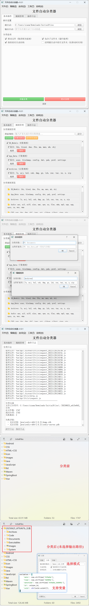

# xuyou-file-classifier

这是一个自动将文件按类型分类到对应文件夹的小工具

项目背景：原有的某个💩项目，需要将文件分门别类，灵光一现，它灵光一现了

## Github

[https://github.com/xuyouer/xuyou-file-classifier](https://github.com/xuyouer/xuyou-file-classifier)

## 软件截图



## 需求

1. [x] [可选分类之前是否会自动备份，防止文件丢失，统计分类后的文件数量并核对文件名，完全一致则分类成功](https://www.52pojie.cn/forum.php?mod=redirect&goto=findpost&ptid=2041507&pid=53317521)
2. [x] 可自选输出分类路径(默认路径: **f"./{日期+唯一ID}分类"**)
3. [x] 分类完成后，继续分类将排除输出分类路径，防止二次重复
4. [x] 可选分类时是否保持原有的子目录结构
5. [x] 可选分类后是否保留原有的文件夹(未成功分类的除外)

## TODO

- 🔲 ~~分类规则存放云端(Github/……)，本地可联网下载使用(视情况决定后续版本是否更新此内容)~~

## TIPS

**注意**

1. 内置的默认分类规则可能部分不符(直接使用的百度搜索结果)，如有不符或需要扩展内置请指出，感谢

## 版本日志

### v1.0.2

更新 [FEAT]：

1. `SettingsManager` 类
    1. `auto_save` 已重命名为 `auto_save_rules` 并调整了其在默认配置中的位置
    2. 新增了 `auto_save_settings` 用于控制程序UI等设置的自动保存
    3. 新增了 `backup_and_verify_source` 选项，用于在分类时备份和校验源文件
    4. 优化了首次启动的逻辑，当检测到是第一次运行时，会自动将所有默认设置写入本地配置文件
2. `SettingsDialog` (设置对话框) 界面调整
    - "分类"选项卡整合所有与文件分类过程直接相关的选项
3. 主界面 (`FileClassifierGUI`) 逻辑更新
    1. "基本操作"选项卡 (`init_basic_tab`)
        1. 新增了 "备份并校验源文件" 的复选框，方便在每次操作时临时启用或禁用
    2. 应用设置 (`apply_settings`)
        - 程序启动时应用新的 `backup_and_verify_source` 设置
    3. 关闭事件 (`closeEvent`)
        1. 根据 `auto_save_settings` 来决定是否在退出程序时保存UI上的选项状态
        2. 保存规则的逻辑已更新为使用 `auto_save_rules`
4. 核心分类逻辑更新
    1. `FileClassifier.classify_files` 方法
        - [分类之前是否会自动备份，防止文件丢失，统计分类后的文件数量并核对文件名，完全一致则分类成功](https://www.52pojie.cn/forum.php?mod=redirect&goto=findpost&ptid=2041507&pid=53317521)
       ```markdown
       备份和校验逻辑：
       
         1. 当启用了备份和校验功能，首先将所有待处理文件备份到一个带时间戳的子目录中
       
         2. 分类操作完成后，会核对移动/复制后的文件是否存在，以验证操作的完整性
       ```
    2. `ClassificationThread` (分类线程)

修复 [FIX]：

1. 不合理的配置

### v1.0.1

更新 [FEAT]：

1. 所有设置存放SettingsManager进行管理
2. 部分功能

修复 [FIX]：

1. 部分不合理的分类规则

### v1.0.0

## 贡献

欢迎提交[Issue](https://github.com/xuyouer/xuyou-file-classifier/issues)
和[Pull Request](https://github.com/xuyouer/xuyou-file-classifier/pulls)来帮助改进这个工具。

## 许可证

本项目采用MIT许可证 - 详见[LICENSE](https://github.com/xuyouer/xuyou-file-classifier/blob/main/LICENSE)文件。
