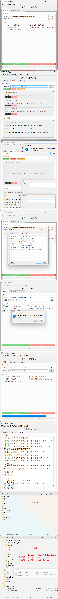

# xuyou-file-classifier

这是一个基于PyQt5开发的自动将文件按类型分类到对应文件夹的实用工具

## Github

[https://github.com/xuyouer/xuyou-file-classifier](https://github.com/xuyouer/xuyou-file-classifier)

## 软件截图

## TODO

- 🔲 分类后是否保留原文件夹(未成功分类的除外)

## 贡献

欢迎提交[Issue](https://github.com/xuyouer/xuyou-file-classifier/issues)
和[Pull Request](https://github.com/xuyouer/xuyou-file-classifier/pulls)来帮助改进这个工具。

## 许可证

本项目采用MIT许可证 - 详见[LICENSE](https://github.com/xuyouer/xuyou-file-classifier/blob/main/LICENSE)文件。